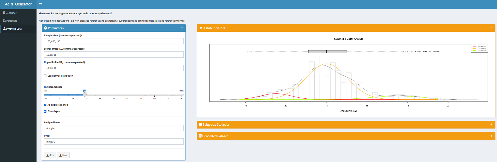

# AdRI_Generator


**Shiny app for generating synthetic laboratory analyte data from age-dependent functions or given reference intervals.**

AdRI_Generator provides three workflows: 

- **Generator** creates age-dependent data using distribution parameters,
- **Percentile** creates normally distributed data from age-specific 95% reference intervals,
- and **Synthetic Data** creates non-age-dependent datasets with multiple subgroups. The age-dependent datasets can be downloaded and used in [AdRI](https://github.com/SandraKla/AdRI); see its [dataset import instructions](https://github.com/SandraKla/AdRI/wiki/Dataset-from-AdRI-Generator).

## Installation

Install `shiny` and `reflimR.expand` before starting the app. Run the following commands in R:

```r
if (!requireNamespace("shiny", quietly = TRUE)) install.packages("shiny")
if (!requireNamespace("remotes", quietly = TRUE)) install.packages("remotes")
remotes::install_github("SandraKla/reflimR.expand")
```

The app installs `DT`, `gamlss`, and `shinydashboard` when they are missing and loads them when already installed.

Packages:
* [R](https://www.r-project.org) ≥ 4.1.2
* [DT](https://cran.r-project.org/web/packages/DT/index.html) ≥ 0.21
* [shiny](https://cran.r-project.org/web/packages/shiny/index.html) ≥ 1.7.1
* [shinydashboard](https://cran.r-project.org/web/packages/shinydashboard/index.html) ≥ 0.7.2
* [gamlss](https://cran.r-project.org/web/packages/gamlss/index.html) ≥ 5.4-1 
* [reflimR.expand](https://github.com/SandraKla/reflimR.expand) ≥ 0.0.2

### Method 1: Run directly from GitHub (recommended)

```r
if("shiny" %in% rownames(installed.packages())){
  library(shiny)} else{install.packages("shiny")
  library(shiny)}
runGitHub("AdRI_Generator", "SandraKla")
```

### Method 2: Run a local copy

Download and extract the repository ZIP file, or clone the repository. Set your R working directory to the extracted project folder containing `app.R`, then run:

```r
shiny::runApp("app.R")
```

## Generator: Age-dependent distribution parameters

The **Generator** tab creates data whose distribution parameters change with age.

| Distribution | Code | Parameters |
| --- | --- | --- |
| Normal | `NO` | μ, σ |
| Log-normal | `LOGNO` | μ, σ |
| Box-Cox Cole & Green | `BCCG` | μ, σ, ν |
| Box-Cox t | `BCT` | μ, σ, ν, τ |
| Box-Cox Power Exponential | `BCPE` | μ, σ, ν, τ |

The parameters describe location (μ), scale (σ), and, where applicable, shape related to skewness (ν) and kurtosis (τ). Their exact interpretation depends on the distribution; for a normal distribution, μ is the mean and σ is the standard deviation.

Each applicable parameter can follow either of these trends:

- **Linear:** `y = m*x + b`, with slope `m` and intercept `b`.
- **Exponential:** `y = a*exp(x*b)`, with coefficients `a` and `b`.

Here, `x` is age in years. A zero slope or exponential coefficient `b = 0` keeps a parameter constant.

1. Set the **maximum age** in years and the **age steps** in days.
2. Choose a distribution and the **number of observations** to generate at each age step.
3. Set the linear or exponential trend for each distribution parameter.
4. Enter the analyte name and unit.
5. Optionally add pathological cases or a limit of detection.
6. Inspect the plot and expandable data table, then download the settings, plot, or data.

For normally distributed data, pathological cases can be added by specifying their amount and an additive shift to μ using **Factor added to mean (µ) for the pathological cases**. This option is documented for the normal distribution only.

The optional **Limit of Detection (LOD)** marks generated values below the threshold as **Below LOD** in the dataset and highlights them in red in the on-screen plot. Leave the field empty to generate data without an LOD threshold.

Negative generated values are removed automatically. Consequently, the final dataset can contain fewer observations than requested.


## Percentile: Generation from reference intervals

The **Percentile** tab generates normally distributed data from age-specific **95% reference intervals**, using the 2.5th and 97.5th percentiles as the lower and upper limits. The reference intervals must describe an analyte that is normally distributed at each age.

For each age, the app calculates the normal-distribution parameters from the lower limit `LL` and upper limit `UL`:

```text
μ = (LL + UL) / 2
σ = (UL - LL) / 3.92
```

The denominator `3.92` is the distance between the normal quantiles −1.96 and +1.96. The app then draws the requested number of observations for each age row. Values at or below zero are removed before export.

Use [Percentile_Table_Template.csv](https://github.com/SandraKla/AdRI_Generator/blob/master/data/Percentile_Table_Template.csv) as a template. Use semicolons as field separators and commas as decimal separators. For example:

```csv
Age [Days];2.5 % Percentile;97.5 % Percentile
365;2;6
730;2;6
1095;3;6
```

Provide reference intervals at sufficiently small age steps to describe the intended age-dependent changes; observations are generated at the supplied ages.

1. Select a preinstalled dataset or upload your own CSV file.
2. Set the **number of observations** per age row.
3. Enter the analyte name and unit.
4. Inspect the plot: the lower reference limit is red, the upper limit is blue, and generated observations are grey.
5. Download the generated data or plot.

The repository includes reference-interval datasets for hemoglobin in women, hemoglobin in men, creatinine in women, and creatinine in men. The pediatric hematology example is described by Zierk et al. (2019).


## Synthetic Data: Non-age-dependent populations

The **Synthetic Data** tab uses `reflimR.expand::synthetic.data` to generate mixed populations, such as a non-diseased reference population combined with pathological subgroups.

1. Enter comma-separated **sample sizes**, **lower limits (LL)**, and **upper limits (UL)**. Each list must contain the same number of entries, with corresponding entries describing one subgroup.
2. Choose a normal distribution or enable **Log-normal distribution**.
3. Adjust the histogram bin count and optionally display a boxplot and legend.
4. Enter the analyte name and unit.
5. Inspect the distribution plot, subgroup statistics, and generated dataset, then download the CSV data or EPS plot.



## Downloads and AdRI integration

CSV downloads use semicolon separators and comma decimal separators (`write.csv2` in R).

The age-dependent Generator and Percentile datasets are intended for use with AdRI and contain age in years and days, generated values, observation IDs, sex, station, and analyte information. Each observation receives a unique ID; this does not imply that all numeric values differ. Sex is unspecified (`NA`) and the station is named `Generator`.

The Synthetic Data export contains `Value`, `Analyte`, `Unit`, and `Origin` (set to `Synthetic`). It does not contain age information or the same columns as the age-dependent AdRI export.

## Contact

You are welcome to:

- Submit suggestions and Bugs at: https://github.com/SandraKla/AdRI_Generator/issues
- Make a pull request on: https://github.com/SandraKla/AdRI_Generator/pulls

## Disclaimer

Only anonymized data may be uploaded to this application. This application is provided “as is” and “as available”, without any express or implied warranties of any kind. No warranty is given regarding the accuracy, completeness, reliability, or timeliness of the results. The results are provided for informational and research purposes only and must not be used for diagnosis, treatment, prevention, or any form of clinical or medical decision-making. This application is not a medical device or medical product and does not replace professional medical advice. To the fullest extent permitted by law, the author disclaims all liability for any direct, indirect, incidental, consequential, or special damages arising from the use of this application or its results. Use of this application is entirely at your own risk.

## References

- Zierk J, Hirschmann J, Toddenroth D, et al. Next-generation reference intervals for pediatric hematology. *Clin Chem Lab Med.* 2019;57(10):1595–1607. [doi:10.1515/cclm-2018-1236](https://doi.org/10.1515/cclm-2018-1236).
- Zierk J, Arzideh F, Rechenauer T, et al. Age- and sex-specific dynamics in 22 hematologic and biochemical analytes from birth to adolescence. *Clin Chem.* 2015;61(7):964–973. [doi:10.1373/clinchem.2015.239731](https://doi.org/10.1373/clinchem.2015.239731).
- Hoffmann G, Klawonn F, Lichtinghagen R, Orth M. Der zlog-Wert als Basis für die Standardisierung von Laborwerten. *Journal of Laboratory Medicine.* 2017;41(1):23–32. [doi:10.1515/labmed-2016-0087](https://doi.org/10.1515/labmed-2016-0087).
