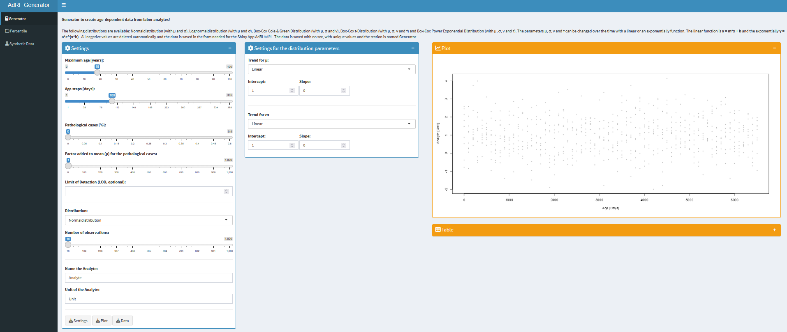
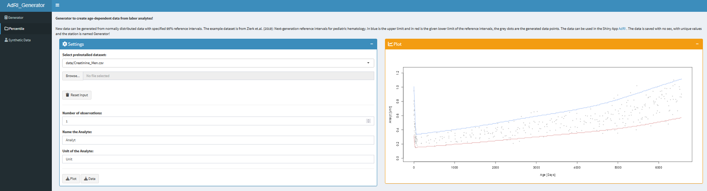

# Age-dependent-Reference-Intervals_Generator (AdRI_Generator)


**Shiny App for generating age-dependent analyt-data using functions or given reference intervals!**

This Shiny App is a generator for creating age-dependent analyt-data (for more information see the [Wiki](https://github.com/SandraKla/AdRI_Generator/wiki)). The data can be downloaded and used in the Shiny App [**AdRI**](https://github.com/SandraKla/AdRI/wiki/Dataset-from-AdRI-Generator).
<br>
</br>




## Installation

Please ensure the [`reflimR.expand`](https://github.com/SandraKla/reflimR.expand) package is installed prior to running the app:

```r
if (!requireNamespace("remotes", quietly = TRUE)) install.packages("remotes")
remotes::install_github("SandraKla/reflimR.expand")
```

**Method 1:**
Use the function ```runGitHub()``` from the package [shiny](https://cran.r-project.org/web/packages/shiny/index.html):

```bash
if("shiny" %in% rownames(installed.packages())){
  library(shiny)} else{install.packages("shiny")
  library(shiny)}
runGitHub("AdRI_Generator", "SandraKla")
```

**Method 2** (not recommended):
Download the Zip-File from this Shiny App. Unzip the file and set your working direction to the path of the folder. 
The package [shiny](https://cran.r-project.org/web/packages/shiny/index.html) (≥ 1.7.1) must be installed before using the Shiny App:

```bash
# Test if shiny is installed:
if("shiny" %in% rownames(installed.packages())){
  library(shiny)} else{install.packages("shiny")
  library(shiny)}
```
And then start the app with the following code:
```bash
runApp("app.R")
```

All required packages are downloaded when starting this app or imported if they already exist. For more information about the required packages use the [Wiki](https://github.com/SandraKla/AdRI_Generator/wiki).
## Updates & Integrations
- **Direct Dependency on reflimR.expand**: The internal generation functions are now imported directly from the reflimR.expand package instead of duplicating code locally.
- **Limit of Detection (LOD)**: Added an optional lod parameter via numericInput in the Generator interface. When specified, generated data points below this threshold are marked (Below LOD) in the dataset and visually highlighted in red on the plot.

## Contact

You are welcome to:

- Submit suggestions and Bugs at: https://github.com/SandraKla/AdRI_Generator/issues
- Make a pull request on: https://github.com/SandraKla/AdRI_Generator/pulls

For more information use the [Wiki](https://github.com/SandraKla/AdRI_Generator/wiki)! 

## Disclaimer

Only anonymized data may be uploaded to this application. This application is provided “as is” and “as available”, without any express or implied warranties of any kind. No warranty is given regarding the accuracy, completeness, reliability, or timeliness of the results. The results are provided for informational and research purposes only and must not be used for diagnosis, treatment, prevention, or any form of clinical or medical decision-making. This application is not a medical device or medical product and does not replace professional medical advice. To the fullest extent permitted by law, the author disclaims all liability for any direct, indirect, incidental, consequential, or special damages arising from the use of this application or its results. Use of this application is entirely at your own risk.

